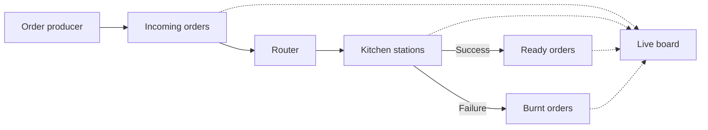

# Chaotic Kitchen

A Kafka hobby project: a chaotic restaurant kitchen.

Orders stream in on Kafka. A router sends them to grill / drinks / dessert stations.
Stations sometimes burn food → **dead-letter topic**. A live board shows the madness.

Useful for learning: topics, producers, consumers, consumer groups, keys, DLQ.

## Tech stack

- Apache Kafka 4.3.1 (Docker, KRaft)
- Python 3.12
- `confluent-kafka` 2.15.1

## Architecture



Solid arrows = order path. Dotted arrows = live board observing. Stations = grill / drinks / dessert.

## Topics

| Topic | Role |
|--------|------|
| `orders.incoming` | New orders |
| `station.grill` | Hot food |
| `station.drinks` | Drinks |
| `station.dessert` | Desserts |
| `orders.ready` | Completed |
| `orders.burnt` | Dead-letter (failures) |

## Setup

```bash
cd /path/to/chaotic-kitchen
python3 -m venv .venv
source .venv/bin/activate
pip install -r requirements.txt
docker compose up -d
```

Wait until Kafka is healthy and `init-topics` finishes (`docker compose ps`).

## Run (separate terminals)

```bash
source .venv/bin/activate

# 1) Live board
python board/main.py

# 2) Router
python router/main.py

# 3) Stations
python workers/station.py grill
python workers/station.py drinks
python workers/station.py dessert

# 4) Flood the kitchen (orders per second)
python producer/main.py 2
```

Turn up the producer rate (`5`, `10`, …) and watch grill lag / burns climb.

## Optional: inspect topics

```bash
# list topics
docker exec -it chaotic-kitchen-kafka \
  /opt/kafka/bin/kafka-topics.sh \
  --bootstrap-server localhost:9092 \
  --list

# consume from the beginning (Ctrl+C to stop)
docker exec -it chaotic-kitchen-kafka \
  /opt/kafka/bin/kafka-console-consumer.sh \
  --bootstrap-server localhost:9092 \
  --topic orders.incoming \
  --from-beginning \
  --property print.key=true \
  --property key.separator=" | "
```

Swap `orders.incoming` for `station.grill`, `orders.ready`, `orders.burnt`, etc.

## Stop

```bash
docker compose down
```

## Concepts covered

- Event-driven pipeline with multiple consumer groups
- Partition key = `order_id` (ordering per order)
- Dead-letter topic for poison / burnt work
- Backpressure / lag visible when grill is slower than intake
